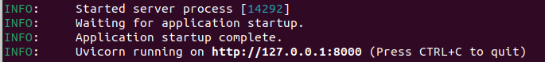
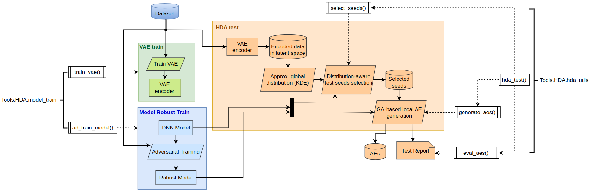
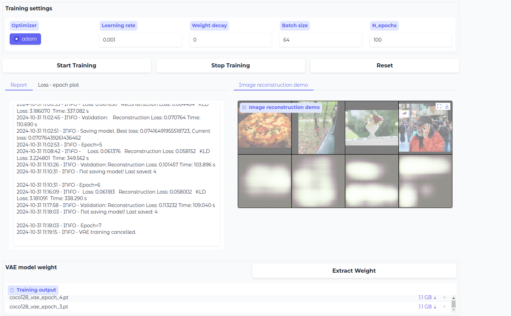
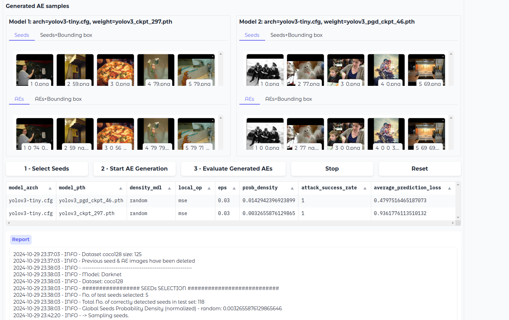
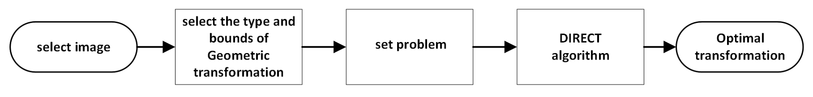
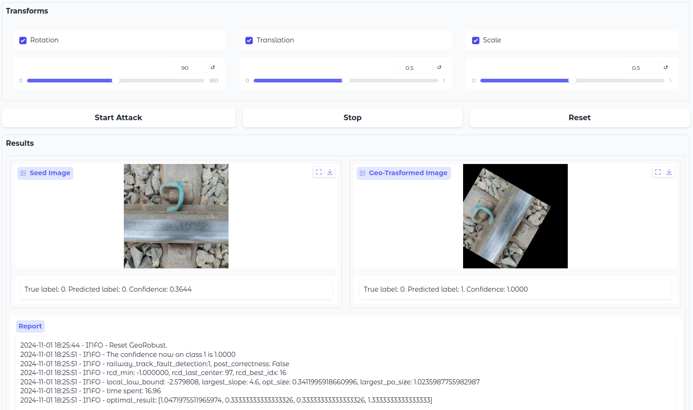
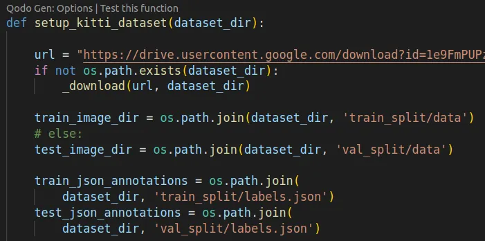
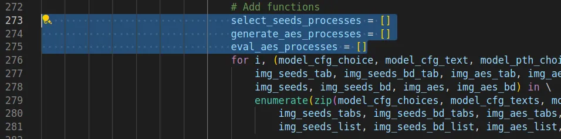

## 🧐 Introduction
This platform provides an integrated GUI to demonstrate our services and for users to explore our DNN robustness verification & validation tools:
1. Run-time Monitor
2. Hierarchical Distribution-Aware (HDA) Testing
3. Geo-Robust Attack

## 🏁 Getting Started
Please ensure that Python 3 and pip are installed.

To play with the tools, simply type `make all` in the command line, which will build the virtual environment and start the interface server.

Navigate with your browser to the IP address indicated by uvicorn in the command line. For example, `http://127.0.0.1:8000`.

### Preparation
Please [download the datasets](https://figshare.com/s/78d66bf1d72bd0c0338f) and save them in the `Dataset/` folder. In addition, [download the model configurations & weights here](https://figshare.com/s/78d66bf1d72bd0c0338f) and saved in the `Checkpoints/` folder. 

## 📋 Descriptions
<h3 id="rt_monitor">Part 1: Run-time Monitor</h3>

### Part 2: HDA Testing
HDA testing incorporates distribution-awareness throughout the testing process, including test seed selection and local test case generation. Robustness and global distribution guide test seed selection, while a novel two-step Genetic Algorithm (GA) based test case generation searches for Adversarial Examples (AEs) balancing local distribution and prediction loss.

We provide interfaces for:
1. Training and fine-tuning customized VAE models
2. Adversarial training of DNN models
3. HDA testing comparing different DNN models

We generate a summary table comparing evaluation metrics across different models and tests.

- [**VAE Train Demo**](https://drive.google.com/file/d/1R9jtg59jk6MuyWyuUu75WrZtjoXe4SAw/view?usp=sharing)

    

- [**HDA Test Demo**](https://drive.google.com/file/d/1ud_aCdv9-m-b9-bAyHDdVs8t_I5hLqY6/view?usp=sharing)

    

- [**Model Robust Train Demo**](https://drive.google.com/file/d/1DdajScksjw7-7lfIhB24TfO1QGvIBveB/view?usp=sharing)

### Part 3: Geo-Robust
The Geo-Robust tool uses the DIRECT algorithm to find the combination of geometric transformations that cause the model to classify the image most incorrectly.

- **Process**

    
- [**Geo-Robust Demo**](https://drive.google.com/file/d/1wKjhY_a8ifMgg4vskd9BPQkdC6efLLzb/view?usp=sharing)

    

### Supported Benchmarks
- Object Detection
    - Dataset: coco128
    - Model: YOLO_V3
- Image Classification
    - Dataset: railway_track_fault_detection
    - Model: Inception_V3

## 👨‍💻 Calling for Contributions
We welcome people to participate in the development and improvement of this platform. Contributions are highly appreciated.

The unit tests ensure the functionality of our key elements in HDA testing, i.e. `vae_train()`, `hda_test()`, and `ad_model_train()`. Please run `make test` after code modifications and ensure all tests pass successfully.

Please feel free to add more automated tests to make our code base more robust.

### Remaining Issues
- **Update README**
    - [ ] README.md: Add Descriptions for <a href="#rt_monitor">Part 1: Run-time Monitor</a>
- **VAE Train Unit**
    - [ ] After inspecting the unittest results, we suspect that there exists a memory leak during VAE model training. Specifically,
        - During VAE training, 4000 MB GPU memory is used up even if batch size=2.
        - The VAE training process on CPU is very slow.
- **Run-time Monitor Unit**
    - [ ] The support of more datasets (VOC & BDD) is needed. This version has been tested to work only on the KITTI dataset.
    - [ ] The download link for KITTI dataset has expired.
        - In `Tools/RTMonitor/data/setup_datasets.py`:
            
    - [ ] Add unittest: Basic functionalities should be automatically tested and guaranteed in continuous development.
- **HDA Testing GUI**
    - [ ] After clicking the Stop button, all processes are cancelled. However, it is impossible for the user to restart any process afterwards.
        - A possible cause is that we have not re-initialized the list of running tasks when the reset button is clicked - The lists are filled with cancelled tasks!
          In `Tools/HDA/gui.py`:
          
    - [ ] The choices of dataset, VAE model weights and DNN model architectures & weights should be grouped by benchmarks.</label> 
        - For example, we can use a drop-down list to obtain the user's choice of benchmark, and then offer corresponding options of datasets, VAE & DNN models according to the selected benchmark.
    - [ ] The support for user uploading DNN model weights in HDA Test.
        - The user experience would be better if we can provide the possiblility to upload model weights from their local device, rather than choose the limited predefined model weights, or manually save the weights in the <code>Checkpoints/</code> folder and type the weight file names in GUI.
        - We have already provided working examples which support user uploading model weights. See VAE Train & Model Robust Train tabs, or Geo-Robust module for reference.
- **GeoRobust GUI**
    - [ ] The Stop button is not working properly.
